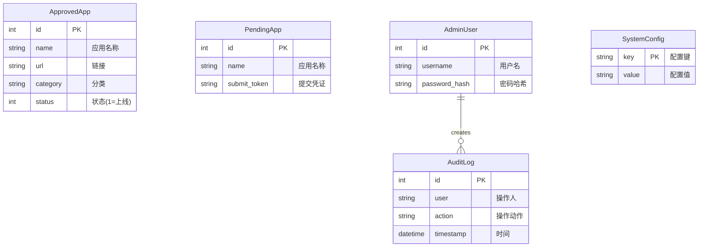

# 办公网网信系统融合应用平台 - 技术文档

本文档详细介绍了办公网网信系统融合应用平台的技术架构、目录结构、代码逻辑及数据模型。

## 1. 项目概述

本项目是一个用于企业/组织内部的导航与应用管理平台，旨在统一管理和展示各类办公系统、业务平台和工具。支持应用分类展示、管理员后台审核、系统配置管理以及用户凭据辅助填充（模拟）等功能。

## 2. 技术架构

### 2.1 架构概览

项目采用前后端分离架构，通过 RESTful API 进行通信。

```mermaid
graph TD
    User[用户] --> |HTTP/HTTPS| Frontend[前端 (Vue 3 + Vite)]
    Admin[管理员] --> |HTTP/HTTPS| Frontend
    
    subgraph "前端 (Frontend)"
        Router[Vue Router]
        Pinia[Pinia Store]
        Views[页面组件]
        Components[UI组件]
        
        Router --> Views
        Views --> Components
        Views --> Pinia
    end
    
    Frontend --> |REST API| Backend[后端 (FastAPI)]
    
    subgraph "后端 (Backend)"
        API[API 路由 (main.py)]
        Auth[认证模块 (OAuth2)]
        Schemas[Pydantic 模型]
        Models[SQLAlchemy 模型]
        DB_Session[数据库会话]
        
        API --> Auth
        API --> Schemas
        API --> Models
        API --> DB_Session
    end
    
    Backend --> |SQL| Database[(SQLite 数据库)]
```

### 2.2 技术栈

*   **后端**:
    *   **Framework**: FastAPI (高性能 Python Web 框架)
    *   **ORM**: SQLAlchemy (数据库对象映射)
    *   **Database**: SQLite (轻量级文件数据库，易于部署)
    *   **Security**: OAuth2 + JWT (管理员认证), BCrypt (密码哈希)
*   **前端**:
    *   **Framework**: Vue 3 (Composition API)
    *   **Build Tool**: Vite (极速构建工具)
    *   **Language**: TypeScript (强类型 JavaScript)
    *   **State Management**: Pinia (Vue 状态管理)
    *   **Styling**: UnoCSS (原子化 CSS 引擎, 兼容 Tailwind CSS)
    *   **Router**: Vue Router (路由管理)

## 3. 目录结构说明

```
d:\NavigationPlatform
├── backend/                # 后端代码目录
│   ├── data/               # 数据库文件存储目录 (自动生成)
│   ├── database.py         # 数据库连接与 Session 配置
│   ├── init_db.py          # 数据库初始化脚本 (建表、种子数据)
│   ├── main.py             # FastAPI 应用入口与路由定义
│   ├── models.py           # SQLAlchemy 数据库模型定义
│   ├── schemas.py          # Pydantic 数据验证模型定义
│   └── requirements.txt    # Python 依赖列表
├── frontend/               # 前端代码目录
│   ├── src/                # 源码目录
│   │   ├── components/     # 可复用 UI 组件
│   │   ├── router/         # 路由配置
│   │   ├── stores/         # Pinia 状态仓库
│   │   ├── views/          # 页面级组件
│   │   ├── App.vue         # 根组件
│   │   ├── main.ts         # 入口文件
│   │   └── style.css       # 全局样式
│   ├── index.html          # HTML 模板
│   ├── package.json        # Node.js 依赖配置
│   ├── uno.config.ts       # UnoCSS 配置文件
│   └── vite.config.ts      # Vite 构建配置
├── docker/                 # Docker 部署相关
├── API_SPEC.yaml           # API 接口规范文档
├── DEPLOY.md               # 部署文档
└── ...
```

## 4. 后端详解 (backend/)

### 4.1 核心文件说明

| 文件名 | 作用 |
| :--- | :--- |
| `database.py` | 配置 SQLite 数据库连接，创建 `SessionLocal` 类用于生成数据库会话，提供 `get_db` 依赖函数。 |
| `models.py` | 定义数据库表结构。包含 `ApprovedApp` (已上线应用), `PendingApp` (待审核应用), `SystemConfig` (系统配置), `AdminUser` (管理员), `AuditLog` (审计日志) 等模型。 |
| `schemas.py` | 定义 Pydantic 模型，用于请求数据的验证和响应数据的序列化。确保 API 接口数据格式的规范性。 |
| `main.py` | 核心入口文件。初始化 FastAPI 应用，配置 CORS，定义所有 API 路由接口，实现认证逻辑。 |
| `init_db.py` | 初始化脚本。用于首次运行时创建数据库表，并填充默认管理员账号 (`admin`/`admin123`) 和示例应用数据。 |

### 4.2 核心函数/接口说明 (`main.py`)

*   **`get_db()`**: 数据库会话依赖，使用 `yield` 确保每个请求结束后自动关闭数据库连接。
*   **`create_access_token(data, expires_delta)`**: 生成 JWT 访问令牌，用于管理员登录后的身份验证。
*   **`get_current_admin(token)`**: 权限依赖函数，解析 JWT Token 并从数据库查找管理员用户，保护管理接口。
*   **`POST /api/submit`**: 用户提交新应用申请，接收 JSON 数据和 Base64 图片，存入 `PendingApp` 表。
*   **`GET /api/apps`**: 获取所有已上线 (`status=1`) 的应用列表，支持按 `category` 筛选。
*   **`POST /token`**: 管理员登录接口，验证用户名密码，返回 JWT Token。
*   **`POST /api/admin/approve/{app_id}`**: 管理员审核通过应用，将数据从 `PendingApp` 转移到 `ApprovedApp`。

## 5. 前端详解 (frontend/)

### 5.1 核心文件说明

| 文件名 | 作用 |
| :--- | :--- |
| `src/main.ts` | 前端入口，创建 Vue 实例，挂载 Router 和 Pinia，引入全局样式。 |
| `src/App.vue` | 根组件，包含全屏动态背景 (SVG 星空)、顶部导航栏 (`NavBar`) 和路由视图 (`router-view`)。 |
| `src/router/index.ts` | 定义路由规则。包含首页、提交页、管理员登录页和后台管理页。配置了全局路由守卫以保护管理页。 |
| `src/stores/theme.ts` | 管理主题状态 (Light/Dark)，持久化存储到 `localStorage`，并动态切换 CSS 变量。 |
| `src/stores/user.ts` | 管理用户会话密码 (Session Password) 和加密逻辑 (PBKDF2 + AES-GCM)，用于前端凭据的安全处理。 |

### 5.2 核心视图 (Views)

*   **`HomeView.vue`**: 首页。展示应用分类 Tabs 和应用卡片网格。负责从后端获取应用数据并根据分类进行筛选展示。
*   **`SubmitView.vue`**: 应用提交页。包含一个复杂的表单，支持图片上传 (Canvas 压缩转 Base64)、内网 URL 格式验证等逻辑。
*   **`AdminLogin.vue`**: 管理员登录页。简单的表单，提交用户名密码换取 Token 并存储。
*   **`AdminDashboard.vue`**: 管理员后台。包含三个标签页：审核看板 (处理待审核应用)、网站配置 (修改标题标语)、卡片管理 (删除已上线应用)。

### 5.3 核心组件 (Components)

*   **`Card_System_v2.vue`**: 应用展示卡片。显示应用图标、名称、描述、分类标签等。包含一键登录 (模拟) 的交互逻辑。
*   **`Badge_Category.vue`**: 分类徽章组件。根据不同的分类 (`web`, `desktop` 等) 显示不同的颜色样式。
*   **`NavBar.vue`**: 顶部导航栏。集成 Logo、标题、导航链接和主题切换按钮。

## 6. 数据模型关系图 (ER Diagram)



## 7. 关键技术细节

1.  **图片处理**: 前端在上传图片时，使用 `Canvas` API 对图片进行尺寸调整 (最大 800px) 和质量压缩，确保最终 Base64 字符串大小适中，减轻后端和数据库压力。
2.  **安全认证**:
    *   后端使用标准的 OAuth2 Password Bearer 流程。
    *   密码存储使用 bcrypt 进行哈希加盐。
    *   API 访问使用 JWT (JSON Web Token) 进行无状态认证。
3.  **前端加密 (模拟)**: `user.ts` store 中实现了基于 Web Crypto API 的 AES-GCM 加密方案，用于在前端安全地处理用户凭据 (演示性质)。
